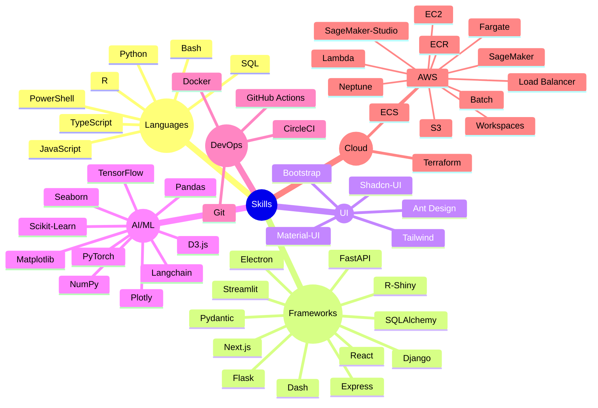

# 👋 Hi, I'm Mahmoud Waheed
### 🤖 AI Student | Data Enthusiast | Future AI Engineer  

🎓 I'm currently studying **Artificial Intelligence** and learning **Data Analysis, Data Science, and Data Engineering** to build a strong foundation towards becoming a **Machine Learning & AI Engineer**.  
💡 Passionate about solving real-world problems with AI, data, and innovative technologies.  

Alternate id - [@pkelucidata](https://github.com/mahmoudwaheed93)

### ⚡ Tech Snapshot

### ✍️ Writing & Blogs  
📚 Featured on: [Substack](https://pratikkumar.substack.com) · [GitHub Blog](https://pr2tik1.github.io) · [Towards AI](https://towardsai.net/author/pratik-kumar)

### 🤝 Connect with Me  
[🌐 Portfolio](https://drive.google.com/file/d/1MtVKFaRBqVyPZlwTWel9nicDL6aF761d/view?usp=sharing) · [💼 LinkedIn](www.linkedin.com/in/mahmmoudwaheed) · [🧑‍💻 GitHub](https://github.com/mahmoudwaheed93) · · 📧 **mahmoudwaheedmahmoud31@gmail.com**

Thanks for visiting! ✨ Let's build something awesome together.

  
  <img src="https://github-readme-streak-stats.herokuapp.
